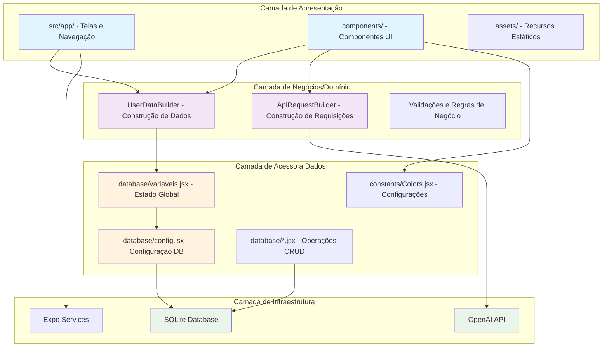

# Análise da Arquitetura do Projeto VGB App

## 1. Identificação da Arquitetura

O projeto **VGB App** utiliza uma **Arquitetura em Camadas** com elementos de **Clean Architecture**, organizando o código de forma modular e com separação clara de responsabilidades.

### Padrão Arquitetural Principal: **Arquitetura em Camadas (Layered Architecture)**

A aplicação está estruturada em camadas bem definidas, onde cada camada tem responsabilidades específicas e comunica-se apenas com as camadas adjacentes.

## 2. Diagrama da Arquitetura



## 3. Mapeamento das Camadas e Componentes

### 🎨 **Camada de Apresentação (UI Layer)**
- **Localização**: `src/app/`, `components/`
- **Responsabilidades**:
  - Renderização da interface do usuário
  - Navegação entre telas
  - Captura de eventos do usuário
  - Exibição de dados

**Principais Arquivos:**
- `src/app/_layout.jsx` - Layout principal e navegação
- `components/Formularios/` - Formulários de entrada de dados
- `components/Header.jsx`, `components/Botoes.jsx` - Componentes reutilizáveis

### 🧠 **Camada de Negócios/Domínio (Business Layer)**
- **Localização**: `database/UserDataBuilder.jsx`, `components/requisicaoGPT/ApiRequestBuilder.jsx`
- **Responsabilidades**:
  - Regras de negócio da aplicação
  - Validação de dados
  - Construção de objetos complexos
  - Lógica de aplicação

**Principais Padrões:**
- **Builder Pattern**: Para construção de dados do usuário e requisições API
- **Validation Layer**: Validação de dados antes da persistência

### 💾 **Camada de Acesso a Dados (Data Access Layer)**
- **Localização**: `database/`
- **Responsabilidades**:
  - Gerenciamento de estado global
  - Operações CRUD no banco de dados
  - Configuração da base de dados
  - Persistência de dados

**Principais Arquivos:**
- `database/config.jsx` - Configuração única do SQLite
- `database/variaveis.jsx` - Estado global e operações CRUD
- `database/UserDataBuilder.jsx` - Abstração para construção de dados

### 🔧 **Camada de Infraestrutura (Infrastructure Layer)**
- **Localização**: `constants/`, `hooks/`, serviços externos
- **Responsabilidades**:
  - Configurações da aplicação
  - Integração com APIs externas
  - Hooks customizados
  - Recursos do sistema

## 4. Análise dos Pontos Solicitados

### ✅ **O projeto respeita a separação de responsabilidades?**

**SIM**, o projeto demonstra boa separação de responsabilidades:

- **Interface separada da lógica**: Componentes UI não contêm regras de negócio
- **Dados isolados**: Operações de banco concentradas na camada de dados
- **Negócios independentes**: UserDataBuilder e ApiRequestBuilder encapsulam lógica específica
- **Configurações centralizadas**: Colors e configurações em arquivos dedicados

**Exemplo prático:**
```jsx
// FormularioGeral.jsx - UI apenas renderiza e captura eventos
const handleSubmit = async () => {
  await new UserDataBuilder()  // Delega para camada de negócios
    .withDadosBasicos({ nome, idade, altura, peso, genero })
    .build();  // Validação e persistência são abstraídas
};
```

### ✅ **É fácil trocar a interface?**

**SIM**, a arquitetura permite fácil substituição da interface:

- **Componentes modulares**: Cada componente tem responsabilidade específica
- **Props bem definidas**: Interface clara entre componentes
- **Expo Router**: Navegação configurável e substituível
- **Estilos centralizados**: Colors.jsx facilita mudanças visuais globais

**Pontos positivos:**
- Troca de React Native para React Web seria facilitada
- Componentes são reutilizáveis
- Lógica de negócio independente da UI

### ⚠️ **Os módulos têm baixo acoplamento e alta coesão?**

**PARCIALMENTE**, há pontos de melhoria:

**✅ Alta Coesão:**
- UserDataBuilder: apenas construção de dados do usuário
- ApiRequestBuilder: apenas construção de requisições
- Componentes UI: cada um com propósito específico

**⚠️ Acoplamento a melhorar:**
- `variaveis.jsx` tem muitas responsabilidades (estado + CRUD + configuração)
- Componentes importam diretamente variáveis globais
- Falta de interfaces/abstrações para operações de dados

**Exemplo de acoplamento alto:**
```jsx
// FormularioGeral.jsx importa diretamente variáveis globais
import { Baltura, Bgenero, BsetNome, inserirOuAtualizarUsuario } from '../../database/variaveis';
```

### ⚠️ **Existe alguma dependência "invertida"?**

**PARCIALMENTE**, há inversão em alguns pontos:

**✅ Inversões existentes:**
- **Builder Pattern**: Interface abstrai implementação
- **Props injection**: Componentes recebem dados via props
- **Config centralizada**: Database config é injetada

**❌ Dependências diretas que poderiam ser invertidas:**
- Componentes dependem diretamente de `variaveis.jsx`
- Não há interfaces para operações de dados
- Estado global acoplado à implementação

**Exemplo de melhoria possível:**
```jsx
// Atual (dependência direta)
import { inserirOuAtualizarUsuario } from '../../database/variaveis';

// Ideal (inversão via interface)
interface UserRepository {
  save(userData: UserData): Promise<void>;
}
```

### 🔄 **O que mudaria na arquitetura atual?**

**Melhorias Recomendadas:**

1. **Implementar Context API**
   ```jsx
   // UserContext.jsx
   const UserContext = createContext();
   // Substituir estado global por contexto tipado
   ```

2. **Criar Interfaces de Repository**
   ```jsx
   // repositories/UserRepository.js
   export class UserRepository {
     async save(userData) { /* implementação */ }
     async findById(id) { /* implementação */ }
   }
   ```

3. **Separar Responsabilidades em variaveis.jsx**
   - `UserState.js` - apenas estado
   - `UserRepository.js` - apenas operações CRUD
   - `DatabaseConfig.js` - apenas configuração

4. **Implementar Services Layer**
   ```jsx
   // services/UserService.js
   export class UserService {
     constructor(userRepository) {
       this.userRepository = userRepository;
     }
     
     async createUser(userData) {
       // lógica de negócio + validação
       return this.userRepository.save(userData);
     }
   }
   ```

5. **Adicionar Validation Layer Independente**
   ```jsx
   // validators/UserValidator.js
   export const validateUserData = (userData) => {
     // validações isoladas da UI e persistência
   };
   ```

## 5. Conclusão

### Pontos Fortes da Arquitetura Atual:
- ✅ Separação clara de camadas
- ✅ Uso de padrões de design adequados (Builder)
- ✅ Componentes modulares e reutilizáveis
- ✅ Configuração centralizada
- ✅ Estrutura de pastas organizada

### Oportunidades de Melhoria:
- 🔄 Reduzir acoplamento entre UI e dados
- 🔄 Implementar inversão de dependências mais robusta
- 🔄 Separar melhor as responsabilidades do estado global
- 🔄 Adicionar camada de serviços para lógicas complexas
- 🔄 Implementar interfaces para abstrair operações de dados
